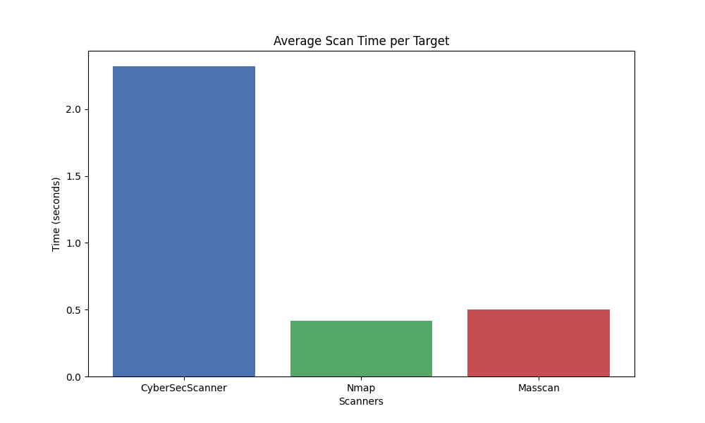
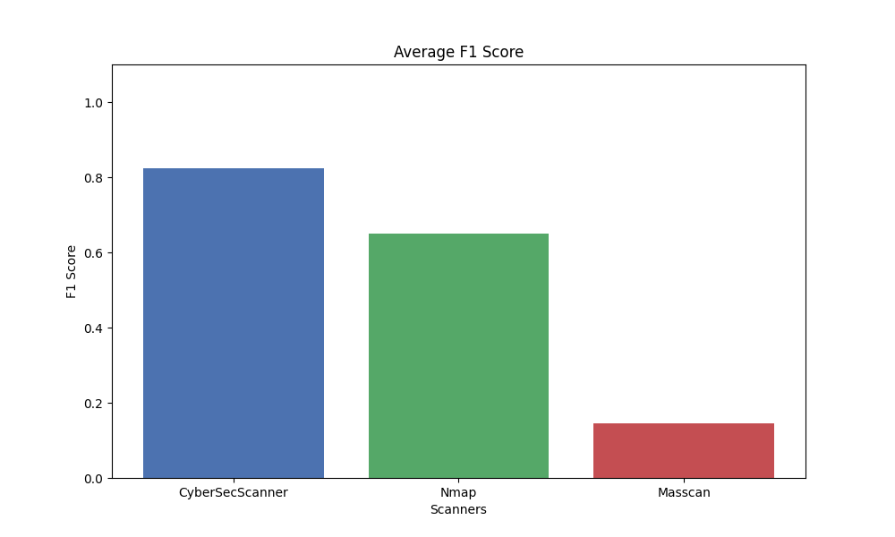
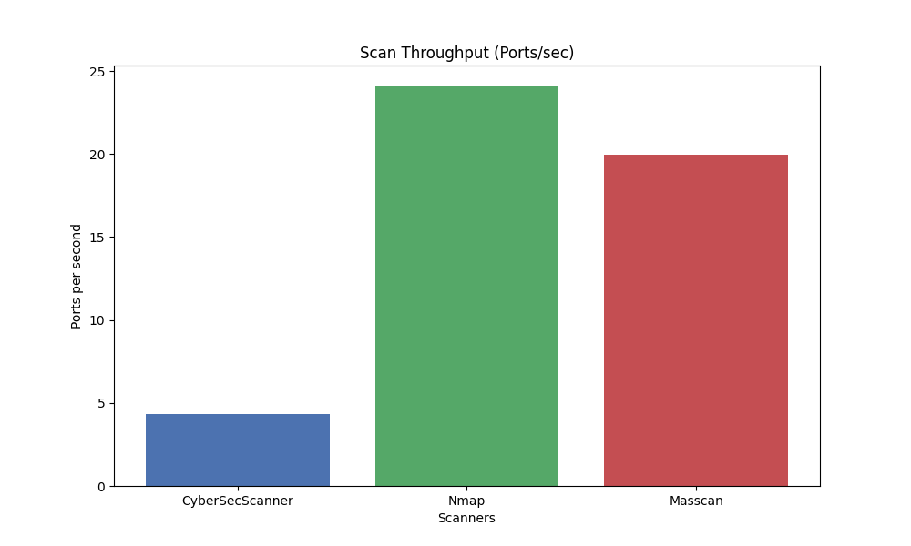

# Port Scanner Benchmark Report
Generated on 2026-04-23 00:33:00

## Executive Summary
Benchmarked scanners: CyberSecScanner, Nmap, Masscan
Total targets: 8
Iterations per scanner: 5

## Methodology
This document presents the evaluation of our custom async port scanner (CyberSecScanner) against standard industry tools like Nmap and Masscan.
Targets represent real-world simulations including active, closed, and dynamically filtered (DROP) ports inside an isolated Docker lab.

## Results Table
| Scanner | Avg F1 Score | Avg Scan Time (s) | Throughput (Ports/s) | Error Rate |
|---|---|---|---|---|
| CyberSecScanner | 0.825 | 2.32 | 4.31 | 0.0% |
| Nmap | 0.650 | 0.41 | 24.13 | 0.0% |
| Masscan | 0.146 | 0.50 | 19.97 | 0.0% |

## Visualizations
### Speed Comparison

### Accuracy Comparison

### Throughput Comparison

## Optimization Recommendations
- Review the slow targets to ensure dynamic socket timeouts do not stall scanner pools.
- Monitor thread and asyncio limits on environments restricted strictly by `ulimit -n`.