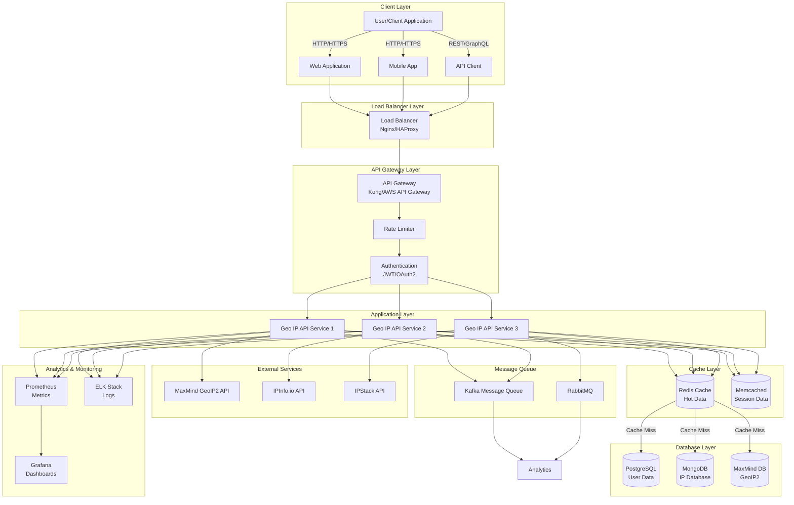
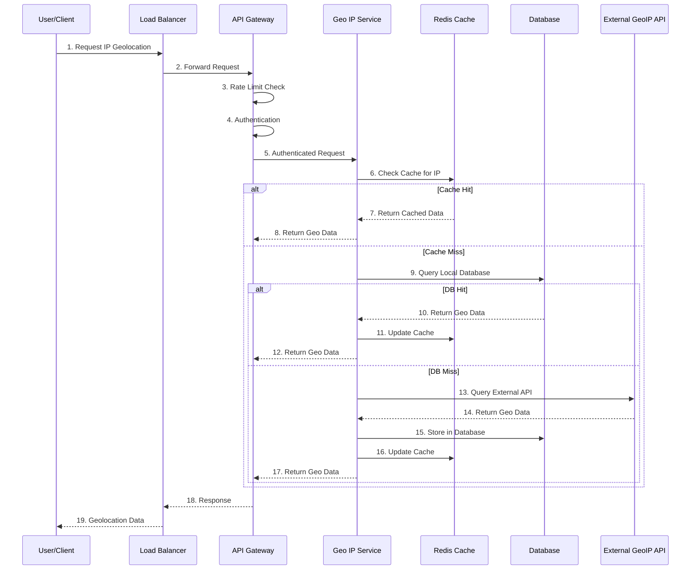
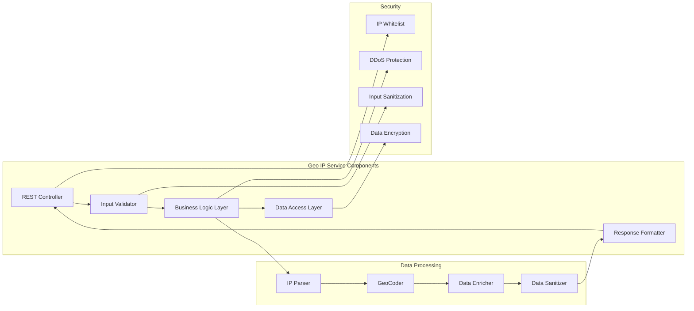
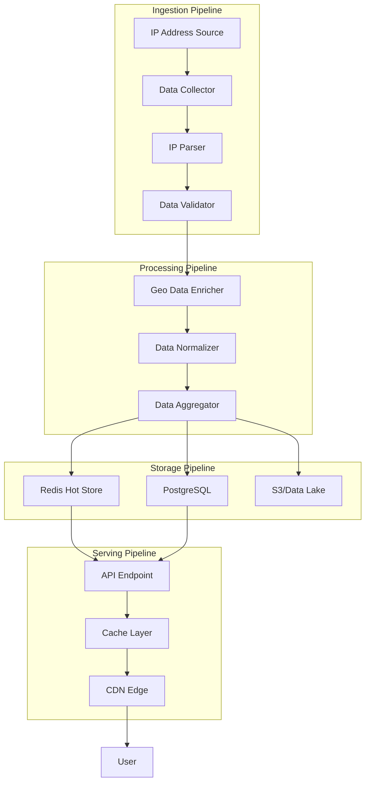
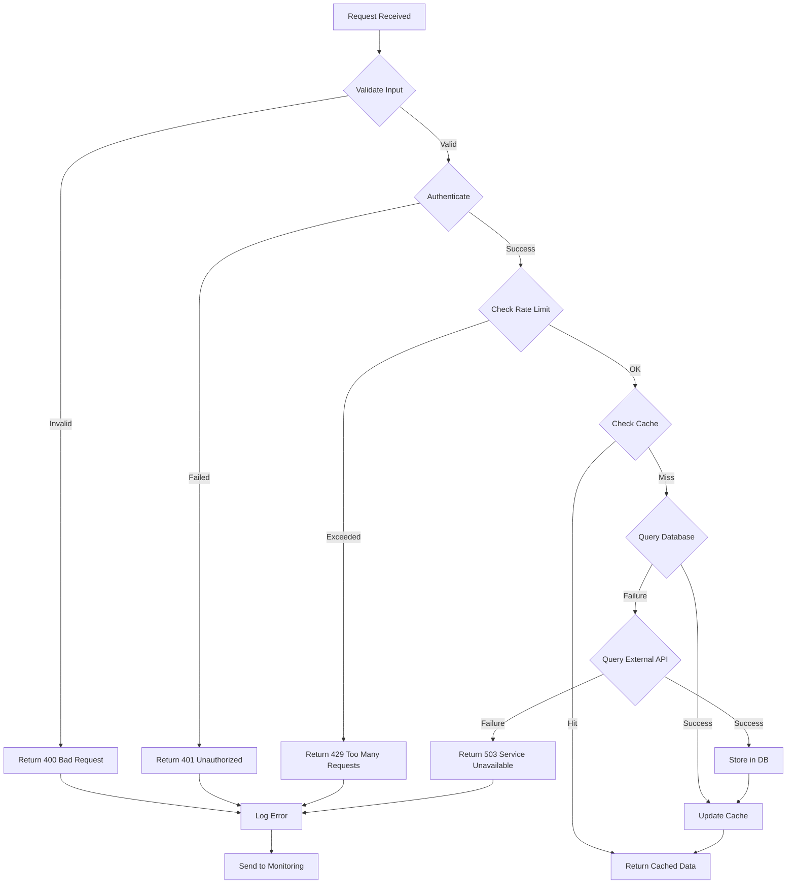
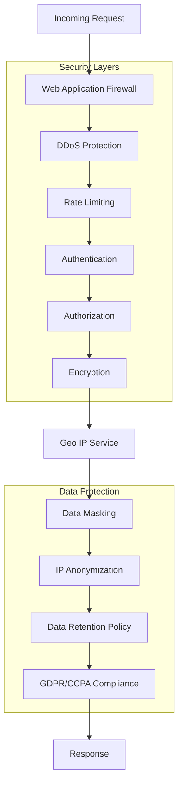

# Geo IP Architecture and User Flow

## System Architecture



## User Flow Diagram



## Detailed Component Architecture



## Data Flow Architecture



## Deployment Architecture

```mermaid
graph TB
    subgraph "Production Environment"
        subgraph "Kubernetes Cluster"
            subgraph "Ingress"
                Ingress[NGINX Ingress Controller]
            end
            
            subgraph "API Services"
                Pod1[Geo IP Pod 1]
                Pod2[Geo IP Pod 2]
                Pod3[Geo IP Pod 3]
            end
            
            subgraph "Database Services"
                RedisPod[Redis Pod]
                PostgreSQLPod[PostgreSQL Pod]
            end
        end
        
        subgraph "External Services"
            CloudSQL[Cloud SQL]
            ElastiCache[ElastiCache]
        end
    end

    subgraph "CDN Layer"
        CDN[Cloudflare/CloudFront]
    end

    User --> CDN
    CDN --> Ingress
    Ingress --> Pod1
    Ingress --> Pod2
    Ingress --> Pod3
    Pod1 --> RedisPod
    Pod2 --> RedisPod
    Pod3 --> RedisPod
    Pod1 --> PostgreSQLPod
    Pod2 --> PostgreSQLPod
    Pod3 --> PostgreSQLPod
    RedisPod --> ElastiCache
    PostgreSQLPod --> CloudSQL
```

## Error Handling Flow



## API Endpoint Architecture

```mermaid
graph LR
    subgraph "REST API Endpoints"
        GET_IP[GET /api/v1/ip/{ip_address}]
        GET_BATCH[GET /api/v1/ip/batch]
        GET_SELF[GET /api/v1/ip/self]
        POST_LOOKUP[POST /api/v1/lookup]
    end

    subgraph "GraphQL Endpoints"
        GraphQL[POST /graphql]
    end

    subgraph "WebSocket Endpoints"
        WS[WS /api/v1/stream]
    end

    subgraph "Response Formats"
        JSON[JSON]
        XML[XML]
        CSV[CSV]
    end

    GET_IP --> JSON
    GET_BATCH --> JSON
    GET_BATCH --> CSV
    GET_SELF --> JSON
    POST_LOOKUP --> JSON
    GraphQL --> JSON
    WS --> JSON
```

## Security Architecture



## Current Implementation Notes

### Cache Implementation

The architecture diagrams above show Redis as the cache layer, which is the intended design for production multi-process deployments. However, the current implementation (`cybersec/core/tools/geoip.py`) uses an **in-memory LRU cache** with the following characteristics:

- **Type**: Process-local `OrderedDict`-based LRU cache
- **Max Size**: Configurable via `GEOIP_CACHE_MAX_ENTRIES` (default: 10,000)
- **TTL**: Configurable via `GEOIP_CACHE_TTL_SECONDS` (default: 3600)
- **Eviction**: LRU-style eviction when max size is exceeded
- **Cleanup**: Periodic background sweep every `GEOIP_CACHE_SWEEP_INTERVAL_SECONDS` (default: 300) to remove expired entries

### Process-Local Limitations

**Important**: The current in-memory cache is **process-local**. If the application runs as:
- Multiple worker processes (e.g., gunicorn with multiple workers)
- Multiple instances behind a load balancer
- Multiple containers in a Kubernetes deployment

Then each process/instance will have its own independent cache with the following implications:

1. **Cache Isolation**: A cache hit in one process is invisible to other processes
2. **Request Volume Undercounting**: The module's rate limiter (`GEOIP_RATE_LIMIT_PER_MINUTE`) is also process-local, so actual upstream request volume to GeoIP providers is undercounted
3. **Memory Duplication**: Each process maintains its own cache copy, increasing total memory usage
4. **Inconsistent Results**: Different processes may return different results for the same IP if their caches are at different states

### Migration Path to Redis

For multi-process deployments, the cache should be migrated to Redis to match the architecture shown in the diagrams. This would:

- Provide a shared cache across all processes/instances
- Enable accurate rate limiting across the entire deployment
- Reduce total memory usage
- Ensure consistent results across all instances

The migration would involve replacing the `_LRUCache` class in `geoip.py` with a Redis-backed implementation using the existing `redis` dependency (already in `pyproject.toml`).
